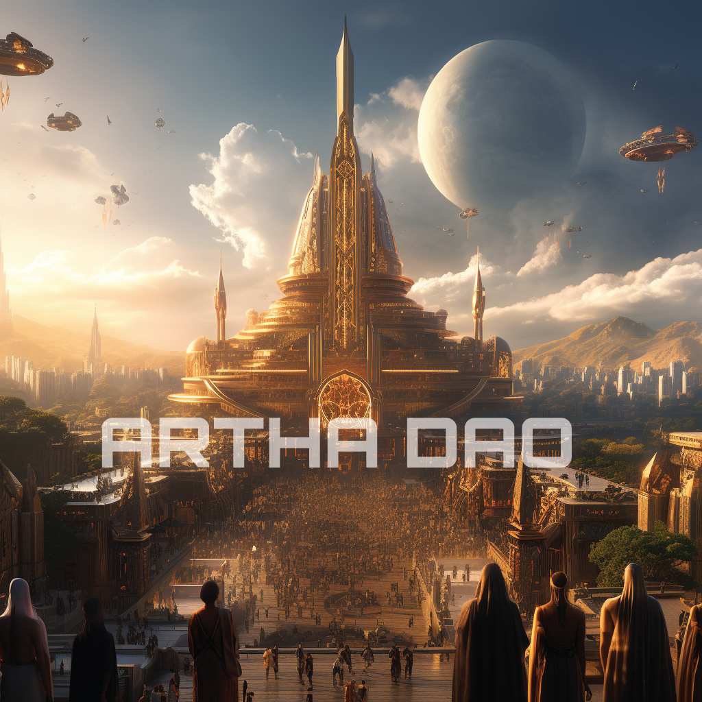

# 🏰 Our Plans.

<figure><figcaption>
ARTHA EMPIRE
</figcaption></figure>


**We don't have a fixed roadmap, but rather a flexible growth map:**&#x20;


## Building a community that engages.

We started our community on [**Telegram**](https://t.me/ArthaDao), just like every token out there, and soon realised that it was getting overwhelmingly filled with folks who were not part of the project. So a decision was made to get the community token gated. We used the toolset provided by [Collab Land](https://docs.collab.land/docs/tutorials/token-gating-tutorial) to allow only folks with a minimum number of $ARTHA tokens entry to the community chat.&#x20;

This is a radical move to test the waters of the use of token gating for early tokens to get focussed engagement from the community of holders. We will tweak and change this as per our needs and as per our growth success.&#x20;

<figure><figcaption>
TOKENGATED COMMUNITY
</figcaption></figure>

***

## Artha Investment Wing. (ARTHA CAPITAL)

<figure><figcaption>
ARTHA CAPITAL
</figcaption></figure>

We started this by registering [arthacapital.eth](https://app.ens.domains/arthacapital.eth) ENS and testing the waters by investing part of the tax collected in other potential projects. This is a key revenue generation wing for us to sustain Artha DAO's growth. This will also partly contribute to revenue share goals with our investors once our market capitalization reaches around 5-10 Million dollars.&#x20;

***

## Artha Software Development Wing.

This will be the software development wing of ARTHA, that will churn on web3 products for consumers and traders in the cryptocurrency markets. This will be focussing on revenue-generating products for Artha DAO and improving overall knowledge around web3 in the space. This will come into action once we have grown decently. We have started a movement around awareness of web3 by hosting #CODEWITHARTHA events on our telegram voice chats and X spaces, where we invite newbies interested in learning more about web3 and know what we are building.

***

## DHARMA.

TBA - OCT 2024
